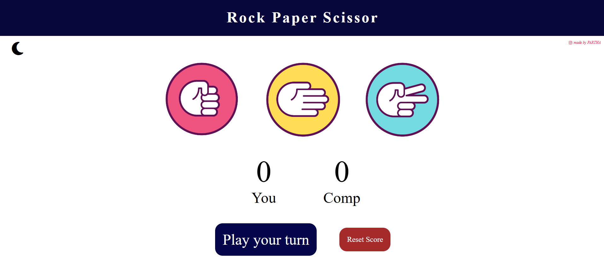

# ✊🖐✌ Rock-Paper-Scissors Game

A simple and interactive Rock-Paper-Scissors game built with HTML, CSS, and JavaScript. It features score tracking, dark/light mode toggle, animations, and stylish feedback for wins, losses, and draws.

---

## 🔗 Live Demo

👉 [https://rock-paper-scissors-partha.netlify.app/](https://rock-paper-scissors-partha.netlify.app/)

---

## 📸 Screenshots

| Screenshots                            |
| -------------------------------------- |
|  |

---

## 🔥 Features

- 🧑‍🤝‍🧑 Player vs Computer logic
- 🧠 Random computer move generation
- 📊 Live score tracking for user and computer
- 🌗 Light/Dark theme toggle
- ⚡ Zoom animation on click
- ✨ Glow effect on winner
- 🔄 Reset button to clear scores

---

## 🧰 Tech Stack

- HTML5
- CSS3
- JavaScript (ES6)

---

## 🎮 How to Play

Click on Rock, Paper, or Scissors to make your move.
The computer will randomly choose its move.
The winner of the round is highlighted and the score updates accordingly.
Press the Reset button to reset scores.
Use the 🌗 mode toggle icon to switch between light and dark themes.

---

## 🧪 Getting Started

### 📦 Installation

Clone the repo :

```bash
git clone https://github.com/PARTHA-PATTANAYAK-02/Rock_Paper_Scissor.git
```

---

## 🌐 Deployment

## This project can be deployed easily using:

- ### 🔗 [netlify](https://rock-paper-scissors-partha.netlify.app/)

## ✍️ Author

**Made with ❤️ by [Partha Pattanayak](https://github.com/PARTHA-PATTANAYAK-02)**
